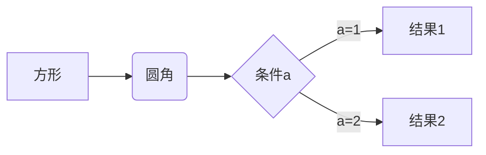
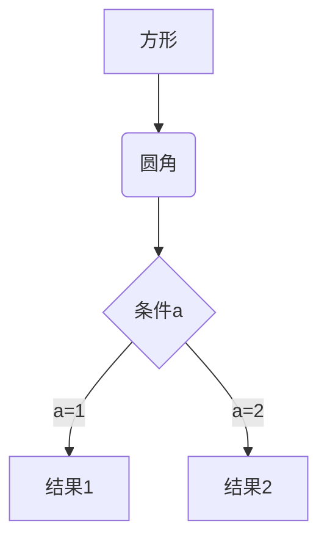
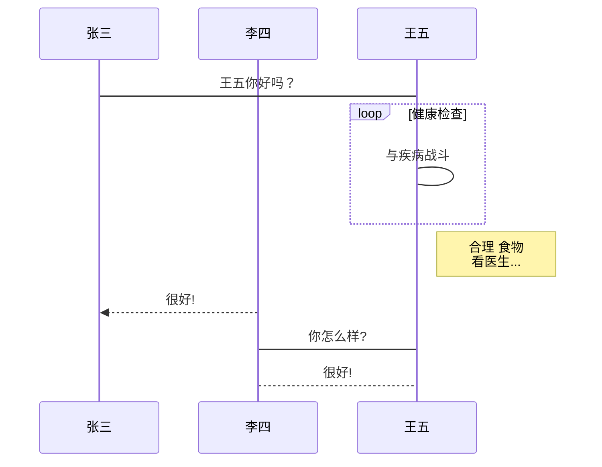
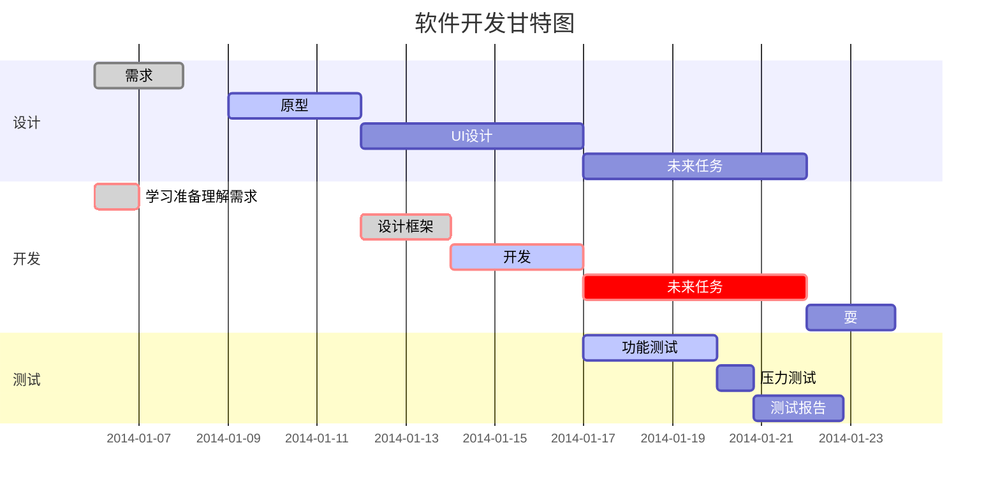

<div id="top"></div>

## 目录
- [文本样式](#文本样式)
  - ...
- [文本字体](#文本字体)
  - [字体大小](#字体大小)
  - [字体颜色](#字体颜色)
  - [字体类型](#字体类型)

## 文本样式

### 加粗、斜体、删除线、下划线、上标、下标、小号字体、大号字体

<div style="width: auto; display: table; margin: auto;">

| 样式类型 | Markdown语法 | 效果示例 |
|----------|---------------------------|-------------|
| **加粗** | `**文本**` 或 `__文本__` | **文本** |
| *斜体* | `*文本*` 或 `_文本_` | *文本* |
| ~~删除线~~ | `~~文本~~` | ~~文本~~ |
| <u>下划线</u> | `<u>文本</u>` | <u>文本</u> |
| 上标 | `上标^2^` 或 `上标<sup>2</sup>` | 上标^2^ |
| 下标 | `下标~2~` 或 `下标<sub>2</sub>` | 下标~2~ |
| 小号字体 | `<small>文本</small>` | <small>文本</small> |
| 大号字体 | `<big>文本</big>` | <big>文本</big> |

</div>

### 列表
- 列表1
  - 列表1.1
    - 列表1.1.1
  - 列表1.2
- 列表2
- 列表3

### mermaid
- 横向流程图


- 竖向流程图



- UML标准时序图


- 甘特图


### 引用
> 引用内容

### 代码块
`代码`
```
代码块内容
```

### 高亮
==文本高亮==

### 分割线
---

### 图片


### 超链接
[超链接描述](超链接地址)

### 脚注
> 文本[^1]

[^1]: 脚注内容

<p align="right">(<a href="#top">top</a>)</p>

## 
## 文本字体

### 字体大小
> size：规定文本的尺寸大小，取值范围为1~7 ，浏览器默认值是 3。注意，size=50也是可以显示的，但与7的字体大小一样

<font size=3>字体大小size=1</font>

### 字体颜色
> color：规定文本的颜色，取值可以是英文单词或十六进制颜色值。

<font color=blue>蓝色</font>
<font color=#ff0000>红色</font>

### 字体类型
> face：规定文本的字体类型，取值可以是英文单词或系统字体名称。

<font face="黑体">黑体</font>
<font face="宋体">宋体</font>
<font face="仿宋">仿宋</font>
<font face="幼圆">幼圆</font>
<font face="楷书">楷书</font>
<font face="华文行楷">华文行楷</font>
<font face="华文隶书">华文隶书</font>
<font face="华文新魏">华文新魏</font>
<font face="华文彩云">华文彩云</font>
<font face="华文琥珀">华文琥珀</font>

<p align="right">(<a href="#top">top</a>)</p>
